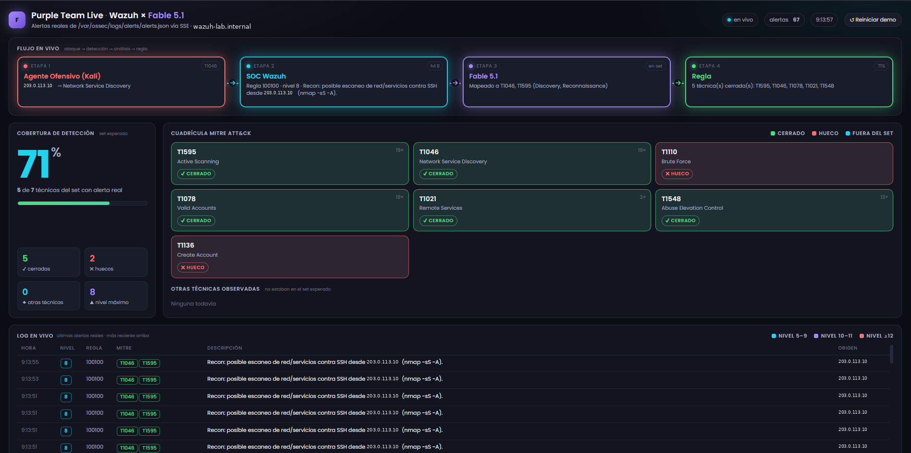
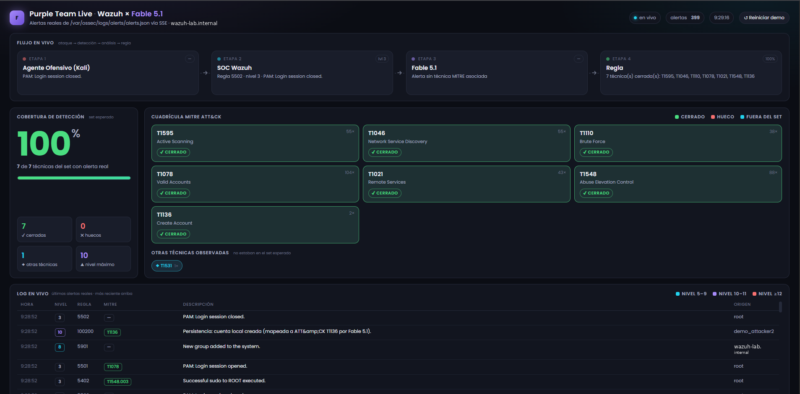

# SOC Purple Team en vivo · Wazuh × Fable 5.1

Demo de *purple team* con un dashboard web en vivo que muestra el flujo
**ataque → detección → análisis → regla** sobre alertas **reales** de Wazuh.
El panel lee `/var/ossec/logs/alerts/alerts.json`, empuja cada alerta al navegador
por SSE (Server-Sent Events) y pinta una cuadrícula MITRE ATT&CK con un porcentaje
de cobertura que sube en directo.

La idea central: se atacan varias técnicas. Wazuh detecta unas (verde) y otras no
(huecos, rojo). El hueco estrella es **T1136 (Create Account)**: Wazuh ve el evento
"New user added" pero no lo mapea a ATT&CK. Se aplica una regla custom que lo mapea,
se re-ataca y la casilla pasa a verde. Eso es **detección como código**.



<sup>Panel durante la demo: flujo ataque → detección → análisis → regla, cuadrícula MITRE
ATT&CK y log de alertas reales. Cobertura 71 % — T1136 (Create Account) sigue en rojo.</sup>

> 📄 **Informe completo con evidencias:**
> [`docs/Informe-SOC-Purple-Team-Wazuh.pdf`](docs/Informe-SOC-Purple-Team-Wazuh.pdf)
> · las 22 capturas de la demo están en [`evidencia/`](evidencia/).

## Arquitectura

```
  Kali externa (o la propia EC2)          EC2 Amazon Linux · IP TU_IP_EC2
  ───────────────────────────             ─────────────────────────────────────
   ataques (nmap, ssh, useradd)  ──────▶   Wazuh manager 4.14.7
                                              │  genera alerts.json
                                              ▼
                                           server.py  (stdlib, tail -F + SSE)
                                              │  escucha en 0.0.0.0:8080
                                              ▼
                                           index.html  ◀── navegador (dashboard en vivo)
```

> **Reemplaza `TU_IP_EC2`** por la IP pública de tu propia EC2 en este README y en
> `docs/GUION_DEMO.txt` antes de arrancar la demo (es la dirección donde se abre el panel).

- **`dashboard/server.py`** — backend en Python de solo librería estándar. Hace
  `tail -F` de `alerts.json` (vía `sudo -n tail`), expone SSE en `/stream`, sirve
  `index.html` en `/`, y ofrece `/api/recent` y `/health`. Escucha en `0.0.0.0:8080`.
- **`dashboard/index.html`** — panel de una sola página. Cuadrícula MITRE, log en
  vivo, flujo de 4 nodos y botón "Reiniciar demo" (usa `localStorage`).
- **`dashboard/run.sh`** — arranque/parada: `start | stop | restart | status | logs`.
- **`wazuh-rules/`** — reglas y decoders custom de Wazuh.
- **`scripts/`** — script del cierre de hueco y del auto-bloqueo.
- **`docs/GUION_DEMO.txt`** — guion paso a paso de la demo.
- **`docs/Informe-SOC-Purple-Team-Wazuh.pdf`** — informe técnico completo: diseño,
  reglas, problemas encontrados y anexo de evidencias.
- **`evidencia/`** — las 22 capturas de la demo, numeradas en orden cronológico
  (del 43 % inicial al 100 % tras cerrar T1136).
- **`report/`** — fuente LaTeX del informe (`.tex`, clase y bibliografía).
- **`LICENSE`** — licencia MIT.

## Requisitos

- Amazon Linux con **Wazuh manager 4.14.7** instalado y corriendo.
- **Python 3.9+** (solo librería estándar, sin dependencias).
- El usuario que arranca el panel debe poder `sudo -n tail` sobre `alerts.json`.
- Puerto **8080/TCP** abierto en el grupo de seguridad para el navegador.

## Montaje y arranque

### 1. Desplegar reglas y decoders de Wazuh

```bash
sudo cp wazuh-rules/local_rules.xml    /var/ossec/etc/rules/local_rules.xml
sudo cp wazuh-rules/local_decoder.xml  /var/ossec/etc/decoders/local_decoder.xml
sudo chown wazuh:wazuh /var/ossec/etc/rules/local_rules.xml /var/ossec/etc/decoders/local_decoder.xml
sudo systemctl restart wazuh-manager
```

> Nota: `local_rules.xml` y `local_decoder.xml` ya incluyen las reglas de recon
> (T1046/T1595) y su decoder. Las reglas de T1136 están aparte en
> `local_rules_t1136.xml` a propósito, porque se aplican **en vivo** durante la demo.

### 2. Arrancar el dashboard

```bash
cd dashboard
./run.sh start        # arranca en http://0.0.0.0:8080
./run.sh status       # comprueba /health
./run.sh logs         # sigue el log
```

Abre `http://TU_IP_EC2:8080` (o la IP pública de tu EC2) en el navegador.
Debe indicar "en vivo" arriba a la derecha.

### 3. (Opcional) Activar auto-bloqueo

`scripts/enable_active_response.sh` activa `firewall-drop` ante alertas de nivel ≥ 10.
**Antes de correrlo**, edita el script y reemplaza los placeholders `IP_GESTION_SSH`
e `IP_GESTION_NAVEGADOR` por tus IPs públicas de gestión, o perderás el acceso SSH.

## Reglas y decoders custom (técnica MITRE)

| Archivo | ID regla | Nivel | Técnica MITRE | Qué hace |
|---|---|---|---|---|
| `local_rules.xml` / `local_rules_scan.xml` | 100099 | 1 | — (base) | Conexión SSH cerrada sin autenticar. Evento base para correlación. |
| `local_rules.xml` / `local_rules_scan.xml` | 100098 | 1 | — (base) | Sonda con protocolo inválido en el puerto SSH (nmap `-A`). Evento base. |
| `local_rules.xml` / `local_rules_scan.xml` | 100100 | 8 | **T1046** (Network Service Discovery), **T1595** (Active Scanning) | ≥2 eventos base desde la misma IP en 5 min ⇒ escaneo de red/servicios. |
| `local_rules_t1136.xml` | 100200 | 10 | **T1136** (Create Account) | **Cierre del hueco.** Hereda de la regla 5902 ("New user added") y le añade el mapeo a T1136. Se aplica en vivo. |
| `local_decoder.xml` / `local_decoder_scan.xml` | decoder `sshd-banner-invalid` | — | — | Extrae `srcip`/`srcport` de las sondas no-SSH de nmap que OpenSSH 9.x registra como "banner exchange … invalid format". |

Las técnicas T1110, T1078, T1021 y T1548 las cubre Wazuh con sus reglas de fábrica
(fuerza bruta SSH, login válido, servicios remotos y escalada con sudo); no requieren
reglas custom.

## Comandos de ataque de la demo

Estos ataques se lanzan desde la EC2 (o desde la Kali externa) y encienden las casillas:

```bash
# Recon / escaneo  -> T1595 + T1046
python3 -c "import socket;[socket.create_connection(('127.0.0.1',22),2).recv(64) for _ in range(3)]"

# Fuerza bruta SSH  -> T1110 + T1021
for i in $(seq 1 8); do ssh -o BatchMode=yes -o ConnectTimeout=2 admin@127.0.0.1 true 2>/dev/null; done

# Login valido  -> T1078
ssh ec2-user@127.0.0.1 true

# Escalada de privilegios  -> T1548
sudo -k; sudo id
```

### El hueco T1136 y su cierre en vivo

```bash
# 1. Se crea una cuenta: Wazuh lo VE (nivel 8) pero NO lo mapea a ATT&CK -> casilla roja
sudo useradd demo_attacker

# 2. Fable aplica la regla que mapea la creacion de cuentas a T1136
./scripts/close_gap_t1136.sh      # espera ~10 s a que Wazuh reinicie

# 3. Mismo ataque, ahora detectado y mapeado -> casilla verde, cobertura 100%
sudo userdel demo_attacker; sudo useradd demo_attacker2
```



<sup>Mismo ataque tras aplicar la regla 100200: T1136 pasa a cerrado, la cobertura llega
al 100 % y la alerta entra en el log con nivel 10 y su etiqueta MITRE.</sup>

### Limpieza tras la demo

```bash
sudo userdel demo_attacker2
# Deshacer reglas: restaura los .bak de /var/ossec/etc/rules/ y reinicia wazuh-manager.
```

El guion completo, con lo que decir en cada paso, está en `docs/GUION_DEMO.txt`.

## Licencia

Distribuido bajo licencia MIT. Ver [`LICENSE`](LICENSE).
